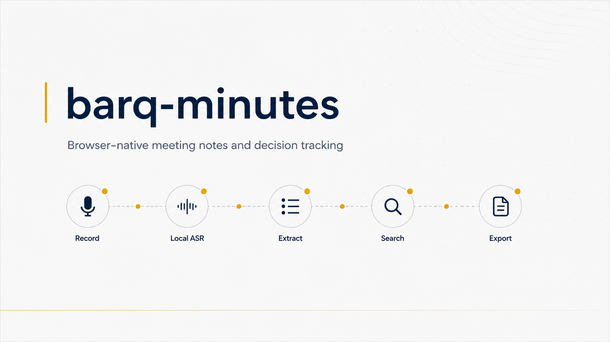
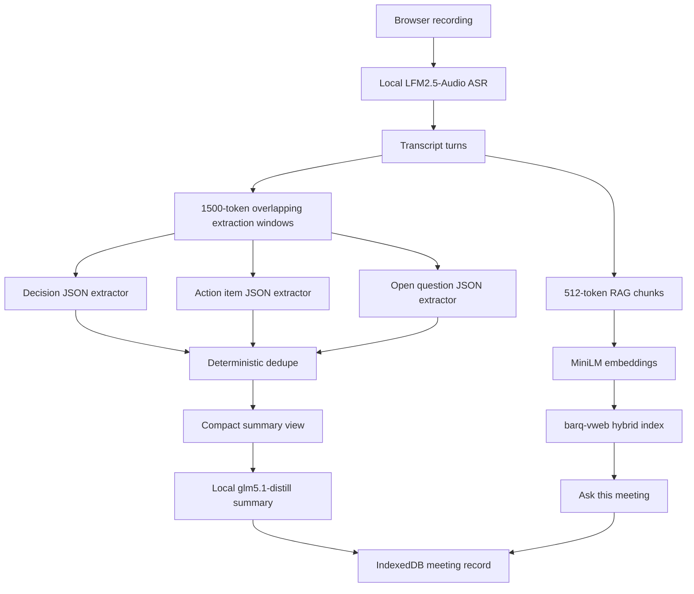

# barq-minutes



barq-minutes is a fully browser-native meeting notes and decision tracker for sensitive work. It records audio in the browser, transcribes locally, extracts structured meeting outputs, and lets users search prior meetings without sending audio, transcripts, prompts, or analytics to a backend.

It is built for NDA-bound consultants, government teams, legal teams, board meetings, and any workflow where meeting content cannot leave the device.

## What It Does

- Records meeting audio in the browser with a live waveform.
- Keeps audio storage opt-in, with transcript-only as the default.
- Loads ASR, LLM, and embedding models in the browser.
- Extracts decisions, action items, open questions, and a 5-bullet executive summary.
- Stores meeting records in IndexedDB.
- Builds a local hybrid search index with `barq-vweb`.
- Answers questions against retrieved meeting chunks and shows the source timestamps.
- Exports Markdown and PDF locally.

## Privacy Position

barq-minutes has no backend and no telemetry. The app is designed so network access is needed only for the initial static app and model asset load. After the model cache is warm, meeting processing runs locally in the browser.

Audio is not stored unless the user explicitly enables audio blob storage on the recording page.

See [PRIVACY.md](./PRIVACY.md) for the full data flow.

## Quickstart

```bash
npm install
npm run dev
```

Open:

```text
http://localhost:5173
```

Production build:

```bash
npm run build
npm run preview
```

## Browser Requirements

Recommended:

- Chrome 113 or later
- Edge 113 or later

WebGPU is used when available. ONNX Runtime Web falls back to WASM where needed.

SharedArrayBuffer requires cross-origin isolation. Vite is configured to serve:

```text
Cross-Origin-Opener-Policy: same-origin
Cross-Origin-Embedder-Policy: require-corp
```

Production deployments must serve the same headers.

## Technology Stack

- Vite, React 19, TypeScript
- `@huggingface/transformers`
- ONNX Runtime Web
- ASR: [LiquidAI/LFM2.5-Audio-1.5B-ONNX](https://huggingface.co/LiquidAI/LFM2.5-Audio-1.5B-ONNX), Q4
- LLM: [yasserrmd/glm5.1-distill-onnx](https://huggingface.co/yasserrmd/glm5.1-distill-onnx), Q4
- Embeddings: [Xenova/all-MiniLM-L6-v2](https://huggingface.co/Xenova/all-MiniLM-L6-v2), Q8
- Vector storage and retrieval: `barq-vweb`
- WASM SIMD support: `barq-wasm`
- IndexedDB storage: `idb-keyval`
- PDF export: `html-to-image` and `jspdf`

## Architecture



## Long-Context Strategy

The LLM context window is 4096 tokens, so the full transcript is never sent to the model in one call.

### Layer 1: Chunked Extraction

- The transcript is split into about 1500-token windows using a 1 token equals 4 characters heuristic.
- Each window targets 6000 characters with 600 characters of overlap.
- The splitter prefers speaker-turn or sentence boundaries near the target split point.
- Each window runs three separate JSON-only LLM calls:
  - `extract_decisions(window)`
  - `extract_action_items(window)`
  - `extract_questions(window)`
- Structured extraction calls use `max_new_tokens: 256` and `temperature: 0.1`.
- Zod validates every response and retries once with a stricter prompt if output is malformed.

### Layer 2: Deterministic Merge

- Extracted text is lowercased, stripped of stopwords, and lightly stemmed.
- MiniLM embeddings are computed locally.
- Items with cosine similarity at or above `0.85` are clustered.
- The longest variant becomes canonical while owner, speaker, due date, and timestamp metadata are merged.

### Layer 3: Final Summary

- The final summary call receives only deduped structured items and a compact list of timestamped speaker turns.
- The compact view is capped under about 1500 tokens.
- If speaker turns do not fit, the summary uses only structured items.
- The result is exactly five executive summary bullets.

### Layer 4: Meeting Q&A

- The full transcript is chunked into 512-token windows with 64-token overlap.
- Chunks are embedded and stored in `barq-vweb`.
- A question retrieves the top 5 chunks and sends only those chunks to the LLM.
- Retrieved chunks are shown with timestamps beside the answer.

## Project Structure

```text
src/
  components/   Reusable UI controls
  models/       Browser model loaders
  pipeline/     ASR, extraction, dedupe, summary, and RAG
  routes/       Dashboard, recorder, meeting detail, settings
  schemas/      Zod schemas and TypeScript types
  storage/      IndexedDB and vector storage wrappers
  styles/       Global styles
  utils/        Time, token, and ID helpers
```

## Validation Status

Current checks:

- `npm run build` passes.
- `npm run dev` serves with COOP and COEP headers.
- Route smoke checks pass for `/`, `/record`, `/settings`, and `/meeting/missing`.
- Tracked files contain no em dash characters.

Real 20-minute and 60-minute audio validation has not been completed because no sample audio files are present in this workspace.

Known audit status:

- `npm audit --audit-level=moderate` reports a `uuid` advisory through `vite-plugin-top-level-await`.
- npm currently offers only a force fix that changes dependency resolution in a potentially breaking way.

## Demo

`demo.gif` is currently a placeholder asset. Replace it with a 30-second capture showing record, process, and meeting detail once sample audio is available.

## License

Apache 2.0. See [LICENSE](./LICENSE).
