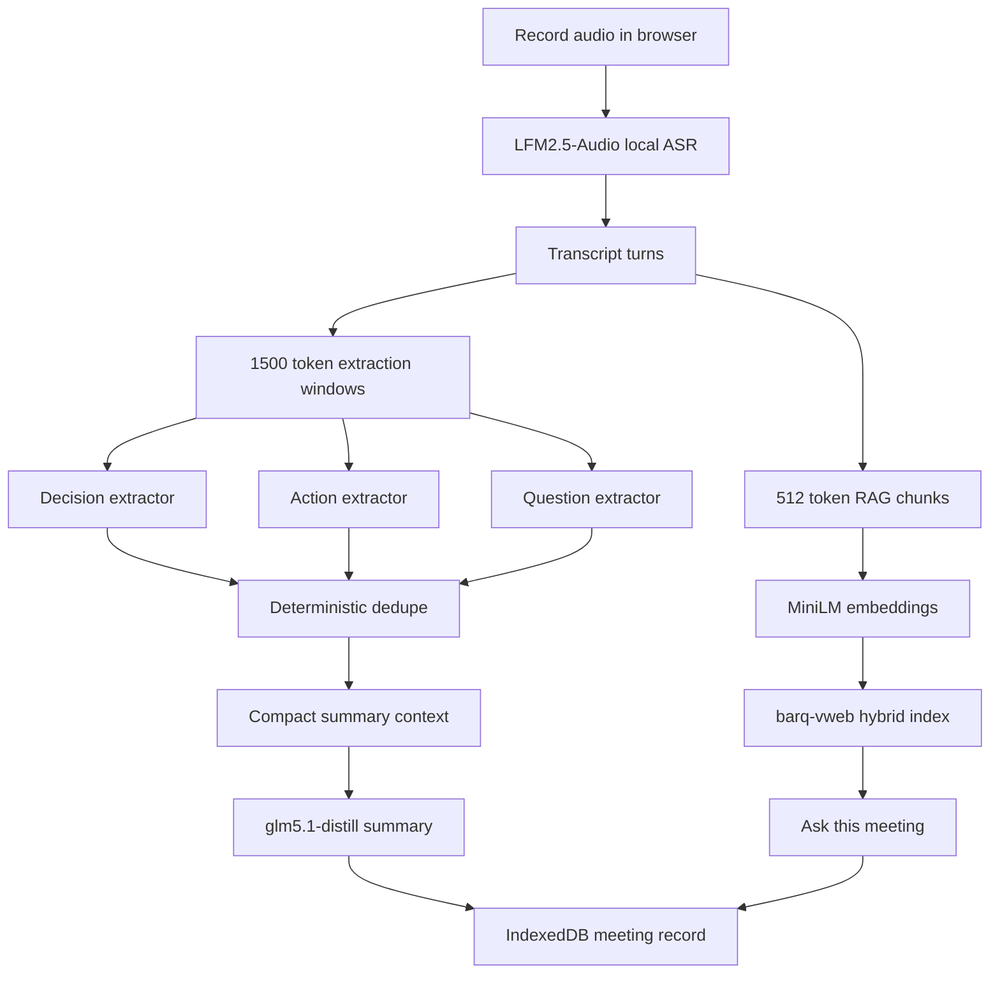

# barq-minutes

barq-minutes is a browser-native meeting notes and decision tracker. It records audio in the browser, keeps meeting data local, extracts decisions, action items, open questions, and summary bullets, then lets the user search a past meeting by text.

The target users are NDA-bound consultants, government teams, lawyers, and other groups that cannot send meeting audio or transcripts to a cloud service.

## Quickstart

```bash
npm install
npm run dev
```

Open `http://localhost:5173`.

Production build:

```bash
npm run build
npm run preview
```

## Browser Support

Recommended:

- Chrome 113 or later
- Edge 113 or later

WebGPU is used for model acceleration when available. WASM fallback is configured for ONNX Runtime Web. SharedArrayBuffer support requires cross-origin isolation, so Vite serves:

- `Cross-Origin-Opener-Policy: same-origin`
- `Cross-Origin-Embedder-Policy: require-corp`

## Models

- LLM: [yasserrmd/glm5.1-distill-onnx](https://huggingface.co/yasserrmd/glm5.1-distill-onnx), Q4
- Base LLM card: [yasserrmd/glm5.1-distill](https://huggingface.co/yasserrmd/glm5.1-distill)
- ASR: [LiquidAI/LFM2.5-Audio-1.5B-ONNX](https://huggingface.co/LiquidAI/LFM2.5-Audio-1.5B-ONNX), Q4
- Embeddings: [Xenova/all-MiniLM-L6-v2](https://huggingface.co/Xenova/all-MiniLM-L6-v2), Q8 compatible ONNX
- Vector search: `barq-vweb`, powered by `barq-wasm`

The first model load downloads weights from Hugging Face. After browser cache warmup, the application is designed to run without backend calls, telemetry, or external inference APIs.

## Architecture



## Long-Context Strategy

`glm5.1-distill` has a 4096 token context window, so barq-minutes never sends a full meeting transcript to the LLM in one request.

Layer 1 extracts structure in chunks:

- Transcript windows target about 1500 tokens by using 6000 characters as the rough limit.
- Adjacent windows overlap by 600 characters.
- Split logic prefers speaker turn boundaries or sentence boundaries near the target.
- Each window gets three separate JSON-only calls: decisions, action items, and open questions.
- Each call is capped at `max_new_tokens: 256` and uses `temperature: 0.1`.
- Zod validates model output and retries once with a stricter prompt.

Layer 2 merges duplicates without the LLM:

- Text is lowercased, stripped of stopwords, and lightly stemmed.
- MiniLM embeddings cluster items with cosine similarity at or above `0.85`.
- The longest text is kept as canonical while metadata is merged.

Layer 3 summarizes only compact data:

- The summary context contains deduped structured items and timestamped speaker turns.
- The context is capped under about 1500 tokens.
- If speaker turns do not fit, only structured items are used.
- One LLM call returns exactly 5 summary strings.

Layer 4 handles post-meeting questions:

- The transcript is chunked into 512-token windows with 64-token overlap.
- Chunks are embedded and stored in `barq-vweb`.
- Questions retrieve the top 5 chunks and pass only those chunks to the LLM.
- Retrieved chunks are shown with timestamps so answers can be checked.

## Privacy Model

- No backend exists in this project.
- No telemetry is configured.
- Meeting records are stored in IndexedDB through `idb-keyval`.
- Audio blob storage is disabled by default and must be opted into on the recording page.
- Export to Markdown and PDF happens in the browser with `html-to-image` and `jspdf`.

## Current Validation Status

Automated local checks run during development:

- `npm run build`
- `npm run dev` with COOP and COEP header verification
- tracked-file scan for em dash characters

Real 20-minute and 60-minute audio validation requires sample files. No audio files are present in this repository yet.

## License

Apache 2.0. See [LICENSE](./LICENSE).
